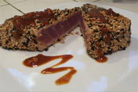

Tuna Steak  
  
   
Easy enough for a weeknight, special enough for company, these marinated tuna steaks cook up quickly on a contact grill. If you like your grilled tuna very rare (as I do), be sure to buy it as fresh and of as high quality as possible, from a reputable fishmonger. If you're new to indoor grilling, be sure to check out my ++[Indoor Grill Cooking Tips](http://cookingequipment.about.com/od/eqipmenttutorials/a/IndoorGrillTips.htm)++.  
**Prep Time: **15 minutes  
**Cook Time: **3 minutes  
**Total Time: **18 minutes  
**Ingredients:**  
* 1/2 cup soy sauce  
* 1/4 cup chopped scallions  
* 2 tablespoons fresh lemon juice  
* 1 teaspoon sesame oil  
* 1 teaspoon ground fresh ginger  
* 4 tuna steaks, about 6 ounces each  
* 1/2 cup sesame seeds, white and black combined, or white only  
* 1/2 teaspoon cornstarch  
**Preparation:**  
1. In a large zip-top bag, combine soy sauce, chopped scallions, lemon juice, sesame oil and fresh ginger. Swish around in bag to combine. Add tuna steaks, turning within bag to coat, and marinate in refrigerator for about 20 minutes.   
2. Preheat contact grill to "Sear" or highest temperature setting. Place sesame seeds on a plate. Remove tuna steaks from marinade bag, brushing scallions off the steaks and reserving marinade. One at a time, coat the steaks in sesame seeds on all sizeds, pressing the seeds into the steak so they'll stick.  
3. Spray the grill plates lightly with nonstick spray and place the steaks on the grill, closing the cover so the top grill rests evenly on the steaks. Grill for about 3 minutes (longer if you prefer your tuna cooked through). Remove from grill and keep warm.  
4. Meanwhile, pour marinade into a small saucepot and bring to a boil. Add cornstarch, stirring with a whisk. Cook for about 3-4 minutes, until sauce thickens.  
5. Drizzle tuna steaks with sauce before serving.  
   
Serves 4.  
* *  
  
*
Pasted from <++[http://cookingequipment.about.com/od/recipes/r/Grilledtuna.htm](http://cookingequipment.about.com/od/recipes/r/Grilledtuna.htm)++> *  
